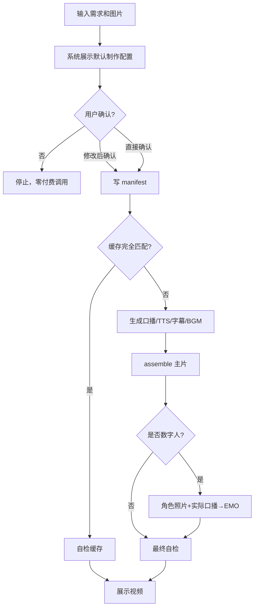
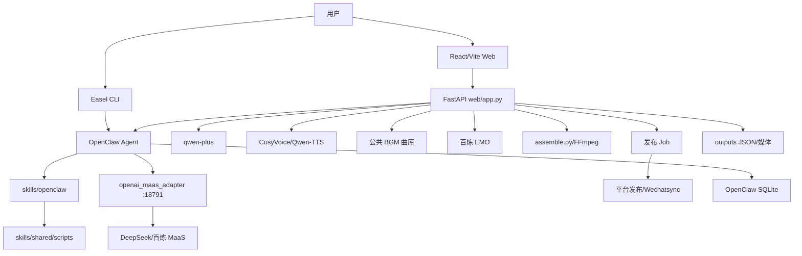
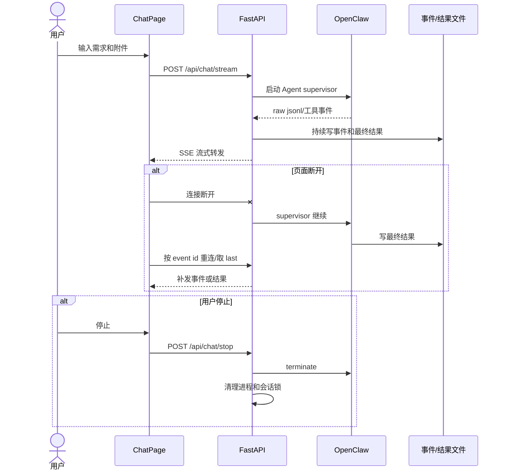
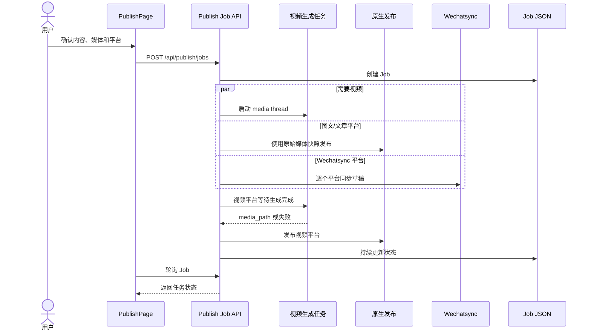

# Easel 全量产品需求 PRD 与技术实现方案

> 本文档描述 Easel 从原始基线到当前目标产品的全部功能改造。文档分为两部分：
>
> 1. **产品需求 PRD**：解释改了什么功能、为什么改、功能如何设计、用户流程和前后差异。
> 2. **技术实现方案**：解释每个需求复用了哪些模块、新增了哪些模块、修改了哪些文件、使用了哪些 Skills、脚本和第三方 API，以及具体如何实现。

---

# 文档范围

| 项目 | 内容 |
|---|---|
| 原始项目基线 | `7cfeca7465927277ae28c5eec471478e224e7017` |
| 基线含义 | 用户首次提交 `7bb8b1d` 之前的项目版本 |
| 已提交改造范围 | `7cfeca7..c2f2965`，共 25 个提交 |
| 当前目标范围 | 上述 25 个提交 + 当前工作树未提交修改 |
| 核心产品目标 | 把“需求描述 + 图片素材 → 高质量垂直领域视频”做到极致 |
| 当前重点业务 | 企业新媒体、企业服务推广、电商商品视频、商品推广、商品详情 |

## 状态定义

- **已实现**：当前代码已存在，并完成自动测试或静态验证。
- **部分实现**：核心能力已存在，但仍需真实第三方 API 或生产场景验证。
- **规划中**：用户已明确提出，已有设计方案，但尚未完成代码实现。
- **废弃/禁止**：曾经尝试但被证明错误，后续不得再次采用。

---

# 第一篇：产品需求 PRD

# 1. 产品背景

## 1.1 原始项目定位

原始 Easel 已经具备 OpenClaw Skill 体系、内容生成能力、基础 CLI/Web 入口、画像和产物目录等能力，但整体更接近“可组合的社媒内容工具集”。

它能够调用不同 Skill 生成文案、图片、视频或执行发布操作，但缺少以下产品化能力：

1. 缺少面向普通用户的一键安装、启动和新手引导；
2. Web 端缺少完整的对话、产物预览和工作流体验；
3. 媒体模型配置分散，图片、视频、音乐、TTS 缺少统一管理；
4. 图文转视频只是零散工具组合，没有稳定的端到端状态机；
5. 音色、BGM、数字人缺少页面级管理和明确默认值；
6. 发布任务缺少持久化、恢复、多平台协同和视频生成依赖处理；
7. OpenClaw 长上下文、会话恢复、并发和成本控制不足；
8. 企业宣传和电商商品视频缺少领域化产品设计。

## 1.2 产品改造方向

本轮所有改造围绕四条主线展开：

### 主线 A：从开发者工具变成可用产品

- 一键安装和启动；
- Web 工作台；
- 新手引导；
- 状态检查；
- 产物预览；
- 使用场景说明。

### 主线 B：从单项生成变成完整内容工作流

- 对话提出需求；
- 生成内容和媒体；
- 查看真实产物；
- 进入发布中心；
- 多平台发布；
- 任务状态恢复。

### 主线 C：把图文转口播视频做成稳定产品链路

```text
需求 + 图片
→ 口播脚本
→ 页面默认 TTS
→ 同步字幕
→ BGM 曲库
→ assemble 合成
→ 数字人
→ 自检
→ 展示/发布
```

### 主线 D：从通用工具走向企业和电商垂直领域

- 企业宣传和企业服务获客；
- 电商商品推广和商品详情；
- 领域脚本模板；
- 事实约束；
- 商品/企业业务数据模型；
- 可规模化的视频生成器。

---

# 2. 目标用户与核心任务

## 2.1 目标用户

| 用户 | 核心任务 |
|---|---|
| 企业市场人员 | 快速把企业服务、品牌信息和活动素材做成短视频 |
| 新媒体运营 | 从热点、文案和图片生成可直接发布的内容 |
| 电商运营 | 把商品素材生成商品推广、上新和详情视频 |
| 创始人/销售负责人 | 用专业口播视频介绍服务、案例和解决方案 |
| 内容创作者 | 使用自己的音色和数字人角色批量生成口播视频 |
| 多平台运营人员 | 一份内容适配并发布到多个平台 |

## 2.2 用户最核心的工作

用户不应理解底层模型和脚本。用户只需要：

1. 提出内容需求；
2. 上传或选择图片；
3. 确认画幅、音色、BGM 和数字人；
4. 等待生成；
5. 查看视频；
6. 修改不满意的要素；
7. 确认发布。

---

# 3. 功能改造总览

| 功能域 | 原始状态 | 改造后目标 | 状态 |
|---|---|---|---|
| 本地部署 | 安装和运行步骤分散 | 一键 setup/start/doctor | 已实现 |
| 新手引导 | 用户不知道先做什么 | 首次引导、配置说明、状态提示 | 已实现 |
| Web 对话 | 基础交互，长任务体验弱 | SSE、深度思考、附件、恢复、停止 | 已实现 |
| 产物查看 | 依赖文件系统查找 | 页面预览文本/图片/音频/视频 | 已实现 |
| 使用场景 | 产品能力不直观 | 使用场景页面和文档 | 已实现 |
| 账号配置 | 平台登录和发布配置分散 | 账号页集中管理 | 已实现 |
| 多平台同步 | 缺少一稿多发操作入口 | Wechatsync + 原生发布 | 部分实现 |
| 发布中心 | 缺少可靠后台任务 | 异步 Job、恢复、取消、重试 | 已实现 |
| 媒体模型 | 各脚本独立读取配置 | 统一模型注册表和配置检测 | 已实现 |
| 图文转视频 | 工具拼接，不稳定 | 完整生成状态机 | 已实现/待真实 PoC |
| TTS | 可能使用脚本默认或 Edge | 页面默认闭源音色，失败停止 | 已实现 |
| BGM | 可能临时生成 | 公共曲库自动/手动选择 | 已实现 |
| 数字人 | 临时图片或媒体库图片 | 角色管理 + 照片和实际音频 | 已实现/待真实 PoC |
| OpenClaw 稳定性 | 上下文截断、并发和恢复问题 | 1M 上下文、会话锁、恢复和诊断 | 部分实现 |
| 企业视频 | 通用视频模板 | 企业信任型视频生成器 | 规划中 |
| 电商视频 | 通用视频模板 | 商品转化型视频生成器 | 规划中 |

---

# 4. PRD-F01：本地部署与新手引导

## 4.1 原始状态

- 安装命令分散；
- Node、Python、FFmpeg、OpenClaw、Playwright 等依赖需要人工排查；
- Local 模式和 Gateway 模式没有清晰切换方式；
- 用户启动失败后不知道缺少什么；
- Web 首页没有首次使用引导。

## 4.2 为什么要改

Easel 的底层能力较多，但安装门槛会直接阻止非开发用户体验产品。媒体生成还依赖完整 FFmpeg、中文字体、浏览器和多个 Provider，必须把环境检查产品化。

## 4.3 功能设计

### 一键安装

`setup.sh` 负责：

1. 检查 Node 版本；
2. 创建 Python 虚拟环境；
3. 安装 Easel 和媒体依赖；
4. 检查/安装 OpenClaw；
5. 初始化 easel profile；
6. 同步 Skills；
7. 构建前端；
8. 提示配置模型和发布平台。

### 一键启动

`start.sh` 支持：

```text
start / stop / restart / status / logs
```

支持两种运行模式：

- Local：资源占用较少；
- Gateway：支持常驻、自动化、ask_user 和并发任务。

### Doctor

检查：

- Python/Node/OpenClaw；
- FFmpeg 和关键滤镜；
- 中文字体；
- Playwright Chromium；
- 前端构建；
- Skill 同步；
- LLM 和媒体 Provider 配置。

### 新手引导

Web 首次使用时展示：

- 产品能力；
- 推荐配置顺序；
- 账号和画像配置；
- 如何开始第一次对话；
- 如何查看产物和发布。

## 4.4 用户流程

```text
下载项目
→ bash setup.sh
→ 配置必要 Key
→ bash start.sh
→ 打开 Web
→ 完成新手引导
→ 开始使用
```

## 4.5 前后差异

| 改造前 | 改造后 |
|---|---|
| 需要阅读多份文档手动安装 | 一个 setup 脚本完成主要安装 |
| 启动命令不统一 | start.sh 统一生命周期 |
| 缺少媒体环境诊断 | doctor 检查 FFmpeg、字体、浏览器和模型 |
| 用户不知道下一步 | Web 新手引导给出操作路径 |

## 4.6 验收标准

- 干净环境可完成安装；
- `start.sh status` 能显示三项服务状态；
- doctor 能准确指出缺失依赖；
- Web 能正常打开；
- 首次用户能在引导后完成一次对话。

---

# 5. PRD-F02：Web 对话、深度思考与产物预览

## 5.1 原始状态

- 对话长任务可能只在命令行可见；
- 用户无法清晰查看 thinking、工具执行和最终媒体；
- 页面断开可能丢失当前结果；
- 生成文件需要用户自己到 outputs 查找；
- 缺少统一停止能力。

## 5.2 为什么要改

内容和媒体任务耗时较长。用户需要知道系统是否仍在工作、当前执行到哪一步，并能直接查看生成结果，而不是依赖终端日志。

## 5.3 功能设计

### SSE 流式对话

- 实时传输文本；
- 支持 thinking 展示；
- 支持工具执行状态；
- 结果和媒体地址随消息返回。

### 深度思考模式

用户可在页面切换思考强度。后端将其传递给 OpenClaw，不同任务可采用不同推理深度。

### 断线恢复

- 后台 supervisor 不因前端断开而停止；
- 事件写入本地文件；
- 页面重连后按 event id 继续；
- 可取回 session 最近一轮结果。

### 显式停止

用户点击停止后：

1. 终止对应 Agent 子进程；
2. 等待 supervisor 清理；
3. 释放会话锁；
4. 页面显示已停止状态。

### 产物预览

支持：

- Markdown/文本；
- 图片；
- 音频；
- 视频；
- 产物目录树；
- 从聊天消息直接打开媒体。

## 5.4 用户流程

```text
输入需求
→ 查看流式思考和执行进度
→ 等待后台完成
→ 页面直接播放视频/图片/音频
→ 需要时停止或重新生成
→ 满意后进入发布
```

## 5.5 前后差异

| 改造前 | 改造后 |
|---|---|
| 长任务像“卡住” | 流式显示状态和结果 |
| 断线可能丢失 | 支持事件重放和最近结果恢复 |
| 文件需手动查找 | 页面直接预览 |
| 无可靠停止 | 可终止并清理会话任务 |

## 5.6 验收标准

- 流式消息不重复、不串会话；
- 页面断开后任务仍可完成；
- 重连可恢复结果；
- 停止后进程和锁被清理；
- 视频可直接播放。

---

# 6. PRD-F03：产品品牌与使用场景说明

## 6.1 原始状态

Skill 数量多，但用户难以理解产品能解决什么业务问题。首页偏工具展示，缺少完整场景说明。

## 6.2 为什么要改

用户购买的是“解决问题的工作流”，而不是 Skill 数量。需要用企业、电商、热点、图文、视频、发布等场景解释价值。

## 6.3 功能设计

- 品牌更新为 ElephBrain AI；
- 新增使用场景页面；
- 增加场景文档；
- 工作台突出发现、策划、制作、发布、归因五层；
- 展示典型输入、执行步骤和产物。

## 6.4 前后差异

| 改造前 | 改造后 |
|---|---|
| 用户看到工具列表 | 用户看到业务场景和结果 |
| 产品定位不统一 | ElephBrain AI 品牌和视觉统一 |
| 缺少示例 | 页面和文档提供操作示例 |

---

# 7. PRD-F04：账号中心与多平台配置

## 7.1 原始状态

各发布 Skill 有独立登录方式，用户需要自己理解扫码、Cookie、Token、Chrome 扩展等差异。

## 7.2 为什么要改

发布失败通常不是内容问题，而是登录态、验证码、平台风控或扩展配置问题。需要集中管理并给出明确状态。

## 7.3 功能设计

账号页统一展示：

- 小红书；
- 抖音；
- 快手；
- 知乎；
- B站；
- 微信视频号；
- 微信公众号；
- Wechatsync。

支持：

- 扫码登录；
- 登录状态查询；
- whoami 真实校验；
- 短信验证码；
- Token 配置；
- Chrome 扩展下载和加载指引；
- Wechatsync CLI/Skill 安装。

## 7.4 Wechatsync 配置顺序

```text
安装/下载 Chrome 扩展
→ 用户手动加载扩展
→ 配置 Token
→ 检查扩展连接
→ 安装或检查 CLI/Skill
→ 查询可同步平台
```

## 7.5 前后差异

| 改造前 | 改造后 |
|---|---|
| 登录方式散落在 Skill 文档 | 账号页集中展示 |
| 配置失败难定位 | 每个平台显示状态和操作建议 |
| Wechatsync 步骤混乱 | 顺序化配置和连接检测 |

---

# 8. PRD-F05：发布中心与异步发布任务

## 8.1 原始状态

发布动作偏同步执行，多个平台和长视频生成混在一次请求里，页面刷新后难以恢复，视频平台与图文平台容易发生媒体竞态。

## 8.2 为什么要改

多平台发布可能持续数分钟，并包含登录、验证码、视频生成和浏览器操作。必须把它建模为可恢复的后台 Job。

## 8.3 功能设计

### 发布中心输入

- 标题；
- 正文；
- 标签；
- 平台；
- 平台差异化正文；
- 图片或视频；
- TTS 音色；
- BGM；
- 数字人角色和位置。

### 异步 Job

任务类型：

- `media`：图片转视频；
- `native`：原生平台发布；
- `wechatsync`：同步为平台草稿。

每个任务记录：

```text
pending / generating / publishing / verifying / ok / fail / cancelled
```

支持：

- 页面轮询；
- 页面刷新恢复；
- 取消任务；
- 短信验证码回填；
- 失败平台重试；
- 历史任务查看。

### 媒体依赖

- 已有视频的平台直接发布；
- 只有图片但目标平台要求视频时，先执行 media task；
- 视频平台等待 media task 完成；
- 图文平台使用原始媒体快照，避免被 media task 后续追加的视频污染。

## 8.4 用户流程

```text
聊天生成内容
→ 点击去发布
→ 发布中心读取 content.json
→ 编辑各平台内容
→ 选择媒体/TTS/BGM/数字人
→ 查看确认摘要
→ 创建后台 Job
→ 查看各平台状态
→ 处理验证码或重试
```

## 8.5 前后差异

| 改造前 | 改造后 |
|---|---|
| 发布是一次性操作 | 发布被建模为持久化 Job |
| 刷新后状态丢失 | 可恢复任务历史 |
| 视频生成与发布容易竞态 | media thread 和平台任务明确依赖 |
| 失败只能整体重来 | 支持失败平台重试 |

## 8.6 验收标准

- Job 状态写入文件；
- 视频平台不会在视频生成前发布；
- 图文平台不会误用后生成的视频；
- 重试保留原始音色、BGM、数字人和确认状态；
- 页面刷新后可恢复任务。

---

# 9. PRD-F06：媒体模型统一配置

## 9.1 原始状态

图片、视频、音乐、TTS 脚本各自读取环境变量，Provider 名称和模型字段容易冲突，Web 页面无法可靠判断配置是否完整。

## 9.2 为什么要改

媒体能力越来越多，如果每个 Skill 自行判断 Key 和模型，会出现：

- 把音乐模型变量当视频模型；
- 页面显示未配置但脚本实际可用；
- 多 Provider 时 Agent 擅自选择；
- 日志泄露 Key；
- 切换 Provider 后行为不一致。

## 9.3 功能设计

建立统一模型注册表，分为：

```text
image / video / music / voice
```

每个 Provider 描述：

- ID；
- 展示名称；
- 必填环境变量；
- 可选模型字段；
- 兼容变量名；
- 哪些字段可以脱敏显示。

## 9.4 选择规则

1. 用户点名且已配置：使用用户选择；
2. 只有一个可用 Provider：显式使用；
3. 多个可用：列出并询问；
4. 零个可用：提示配置，不发请求；
5. 整个任务保持同一 Provider/Model；
6. 不通过 `env` 判断 `.env` 中的配置；
7. 不输出 Key 真值。

## 9.5 前后差异

| 改造前 | 改造后 |
|---|---|
| 每个脚本自己定义配置 | 注册表统一定义 |
| Web 和脚本可能不一致 | Web 复用同一注册表 |
| 模型字段容易串用 | 视频、音乐、TTS 模型字段分离 |

---

# 10. PRD-F07：图文生成口播视频

## 10.1 原始状态

原始链路主要依赖 Skill 临时组合：写文案、生成图片、TTS、字幕、BGM、FFmpeg。缺少统一的输入确认、状态、缓存和失败策略。

出现过的实际问题：

- 没有询问音色、BGM 和数字人；
- 使用脚本默认音色；
- TTS 失败后静默降级；
- BGM 曲库已有音乐仍调用付费模型；
- 数字人走错普通 I2V；
- Agent 多轮调用模型导致大量 Token 消耗；
- 旧视频缓存被错误复用；
- 数字人失败仍把无数字人的视频当成功结果。

## 10.2 为什么要改

完整视频不是单个模型调用，而是一条有依赖、有费用、有中间产物、有失败边界的生产流水线。必须从 Agent 自由发挥升级为确定性状态机。

## 10.3 产品输入

- 主题/标题；
- 正文/需求；
- 图片列表；
- 目标平台；
- 画幅；
- TTS 音色；
- BGM；
- 数字人角色；
- 数字人位置；
- 是否强制重新生成。

## 10.4 制作配置确认

生成前必须展示：

```text
画幅
TTS 引擎、音色名和 ID
BGM 曲目或自动匹配
数字人角色和位置
脚本模型及最大次数
TTS 最大短句调用次数
EMO 最大次数
AI 生图次数
普通 I2V 次数
AI 音乐次数
```

未确认时所有付费调用为 0。

## 10.5 正确流程

```text
用户需求+图片
→ 配置查询与确认
→ 写 generation manifest
→ 完整 fingerprint 缓存检查
→ 每图一段口播稿
→ 页面确认音色 TTS
→ 拼接完整口播
→ 合并逐句字幕
→ 从公共 BGM 曲库选曲
→ assemble.py 合成 base.mp4
→ 可选 EMO 数字人
→ ffprobe 自检
→ 展示成片
```

## 10.6 用户流程



## 10.7 前后差异

| 改造前 | 改造后 |
|---|---|
| Agent 临时决定配置 | 页面默认值+用户确认 |
| 多轮模型思考 | 一个确定性生成状态机 |
| 缺少生成清单 | manifest 记录配置和调用上限 |
| 仅按标题/音色缓存 | 完整 fingerprint |
| 失败后继续降级交付 | 必选环节失败即停止 |
| 中间文件被删除 | 成功和失败均保留 assets |

## 10.8 验收标准

- 图片数量和口播段数一致；
- 每镜时长来自实际口播；
- 音频和字幕完整；
- BGM 不盖口播；
- 用户要求数字人时必须真正包含数字人；
- 最终文件有视频轨、音频轨和正时长；
- 未确认不调用任何媒体模型。

---

# 11. PRD-F08：TTS 与音色管理

## 11.1 原始状态

- TTS 主要依赖脚本参数或默认音色；
- 页面没有完整音色管理；
- 不同引擎的默认音色会互相覆盖；
- 克隆音色状态和试听不完整；
- 失败可能降级到 Edge；
- Agent 可能传入不属于当前引擎的音色。

## 11.2 为什么要改

口播音色是用户最直接感知的成片质量之一。用户需要在页面试听和设置默认值，生成链路必须忠实使用该配置。

## 11.3 功能设计

### 双引擎

- CosyVoice；
- Qwen-TTS。

### 音色类型

- 系统音色；
- 克隆音色；
- Qwen 系统音色。

### 页面能力

- 引擎切换；
- 音色筛选；
- 音色搜索；
- 试听；
- 设置默认；
- 克隆声音；
- 查询部署状态；
- 删除克隆音色。

### 默认值规则

```text
本轮用户选择
> 页面当前默认
> 对应引擎回退值
```

每个引擎使用独立默认音色文件。

## 11.4 TTS 失败规则

- 只允许页面确认的闭源音色；
- 禁止 Edge TTS；
- 禁止自动换音色；
- 闭源失败立即停止视频任务；
- 返回原始 Provider 错误；
- 修复配置后再重试。

## 11.5 CosyVoice 418 错误复盘

错误原因不是 CosyVoice 服务不可用，而是旧流程把 Edge 音色 ID `zh-CN-YunyangNeural` 传给了 CosyVoice。

正确处理：

1. 从页面 API 读取真实 voice ID；
2. 在请求前判断 voice ID 属于哪个引擎；
3. 未知音色前置失败；
4. 不向 CosyVoice 发送 Edge 音色；
5. 不降级 Edge。

## 11.6 前后差异

| 改造前 | 改造后 |
|---|---|
| 脚本默认音色 | 页面默认音色 |
| 单一默认值 | 每引擎独立默认 |
| 克隆音色管理弱 | 创建/状态/试听/默认/删除 |
| 失败降级 Edge | 失败停止 |
| Agent 可传错引擎音色 | 后端识别真实音色引擎 |

---

# 12. PRD-F09：BGM 曲库

## 12.1 原始状态

- BGM 可能来自临时文件；
- Agent 会因为认为“本地没有合适音乐”调用 AI 音乐；
- 用户无法在发布前选择；
- 曲目风格没有统一维护。

## 12.2 为什么要改

背景音乐应优先复用已有资产。普通“加 BGM”不等于授权创建付费音乐。需要把 BGM 变成可管理的公共资产库。

## 12.3 功能设计

BGM 页面支持：

- 上传；
- 试听；
- 风格标记；
- 删除；
- 查看来源。

风格包括：

```text
企业宣传 / 电商促销 / 热门卡点 / 图文轻快 / 情感叙事 / 科技数码 / 其他
```

发布页支持：

- 自动匹配曲库；
- 手动选择具体曲目；
- 显示曲名和风格。

## 12.4 自动选曲规则

1. 根据标题和正文识别内容风格；
2. 选择同风格曲目；
3. 按领域回退链选择相近风格；
4. 仍无标签匹配时，从公共曲库稳定哈希选择；
5. 曲库为空才无 BGM。

## 12.5 AI 音乐规则

只有用户明确说“生成原创 BGM/AI 作曲”，并确认模型、次数和费用后，才允许调用 AI 音乐。

普通视频默认：

```text
AI 音乐调用次数 = 0
```

## 12.6 前后差异

| 改造前 | 改造后 |
|---|---|
| Agent 自行决定音乐来源 | 公共曲库是默认来源 |
| 用户无法指定 | 发布页可手动选曲 |
| 可能意外产生付费 | 普通 BGM 禁止触发 AI 音乐 |
| 风格不受控 | 曲目有风格元数据 |

---

# 13. PRD-F10：数字人角色管理与口播数字人

## 13.1 原始状态

- 数字人可能临时上传图片；
- 发布页可能从媒体库选择任意图片；
- 没有“角色”概念；
- 图片不能稳定复用；
- Agent 曾临时生成男性主播图片；
- 普通 I2V 人物微动被错误称为数字人；
- 没有使用实际口播音频驱动口型。

## 13.2 为什么要改

数字人是长期品牌资产，必须先创建角色，再在不同视频中复用同一形象。数字人口播必须由角色照片和本轮真实音频共同生成。

## 13.3 功能设计

### 数字人角色

角色包含：

- ID；
- 名称；
- 描述；
- 持久化照片；
- 创建时间。

### 角色管理页

- 上传照片创建角色；
- 查看角色卡片；
- 图片预览；
- 删除角色；
- 支持一个或多个角色。

### 生成时选择

- 请求明确包含数字人且只有一个角色：确认表默认该角色；
- 有多个角色：列出后由用户选择；
- 没有角色：提示先创建；
- 发布页显示角色缩略图和位置。

### 数字人生成

当前默认引擎：百炼 EMO。

```text
角色照片
+
本轮 narration_full.mp3
→ EMO 人脸检测
→ 创建异步任务并写入 tasks.json
→ 轮询（服务重启后可恢复任务记录）
→ 下载数字人口播视频
→ 叠加到 base.mp4
```

## 13.4 失败规则

用户明确要求数字人时：

- 角色不存在：任务失败；
- 照片不存在：任务失败；
- 音频不存在：任务失败；
- EMO 失败/超时：任务失败；
- overlay 失败：任务失败；
- 不能交付无数字人的主片作为完整成片。

## 13.5 永久禁止

- AI 生图临时生成主播；
- 普通 Wan I2V 冒充数字人；
- 循环 8 秒人物视频；
- 复用历史 avatar；
- 使用媒体库任意图片；
- 不传本轮口播音频。

## 13.6 前后差异

| 改造前 | 改造后 |
|---|---|
| 临时图片 | 持久化角色 |
| 任意媒体图片 | 角色 ID |
| 人物微动 I2V | 照片+音频 EMO |
| 形象不稳定 | 同角色跨视频复用 |
| 失败仍交付主片 | 数字人是必选时失败即停止 |

## 13.7 后续候选

- SadTalker：Mac 本地保底；
- LivePortrait/JoyVASA：中文和人像驱动候选；
- MuseTalk MLX：已有视频唇形同步；
- EchoMimic V2/V3、Hallo2：建议远程 NVIDIA GPU，不作为当前 Mac 默认方案。

---

# 14. PRD-F11：OpenClaw 稳定性与成本控制

## 14.1 原始状态

- 长会话超过默认预算后触发 compaction；
- 压缩后消息结构可能损坏；
- toolCall/toolResult 失配；
- Agent 输出只有 reasoning，没有可交付文本；
- 同一会话并发可能互相覆盖；
- ask_user 在 Gateway 未运行时失败；
- Agent 为完成视频可能调用几十次 LLM。

## 14.2 为什么要改

视频和发布任务包含很多工具调用，如果会话层不稳定，会造成任务中断、重复付费和错误续跑。

## 14.3 功能设计

### 1M 上下文

DeepSeek 模型声明：

```text
contextWindow = 1048576
contextTokens = 1048576
maxTokens = 65536
```

### MaaS Adapter

- OpenAI Chat Completions 兼容；
- 模型名前缀移除；
- token 字段兼容；
- SSE 流式转发；
- finish_reason 和 usage 诊断；
- 600 秒以上超时策略；
- 不继承错误系统代理。

### 会话并发

- asyncio 会话锁；
- fcntl 跨进程锁；
- supervisor 后台执行；
- stop 后释放锁；
- 事件落盘和重放。

### 成本控制

- 配置确认前只查询三个免费 API；
- 不搜索大量历史会话决定当前配置；
- 口播脚本模型最多 1 次；
- LLM 失败使用确定性逻辑；
- 媒体调用写 manifest；
- 重试可能产生费用时重新确认。

## 14.4 前后差异

| 改造前 | 改造后 |
|---|---|
| 默认上下文预算过小 | 模型声明 1M context |
| 压缩错误难定位 | Adapter 和轨迹日志可诊断 |
| 页面断线影响任务 | supervisor 继续执行 |
| 多轮自由推理成本高 | 确定性视频状态机 |
| Gateway 未运行交互失败 | Gateway 模式和状态检查 |

---

# 15. PRD-F12：企业与电商垂直视频生成器

## 15.1 当前状态

该部分是用户明确的产品方向，已形成产品和技术设计，但尚未完整实现专用页面、Skill 和 API。

## 15.2 企业视频需求

### 企业真实诉求

- 品牌认知；
- 企业服务获客；
- 招商和招聘；
- 新品/服务发布；
- 活动传播；
- 客户教育；
- 专业信任；
- 客户沟通。

### 视频结构

```text
0-5s：Hook
5-15s：问题展开
15-30s：方案介绍
30-45s：实力证明
45-60s：CTA
```

### 企业事实规则

- 企业数据、客户案例、资质和价格必须有来源；
- 模型不得补造；
- 高监管行业必须人工或法务终审。

## 15.3 电商视频需求

### 商品业务对象

- SPU；
- SKU；
- 渠道；
- 活动；
- 商品事实卡；
- 交易规则卡；
- 商品内容 Brief。

### 视频结构

```text
0-3s：Hook
3-8s：痛点共鸣
8-15s：产品亮相
15-25s：卖点展开
25-28s：信任背书
28-30s：CTA
```

### 商品事实规则

- 价格、库存、促销、参数、功效不得猜测；
- 卖点必须有来源和证据等级；
- 防止混款、错价和过期卖点；
- AI 负责氛围和转场，真实细节优先使用实拍。

## 15.4 规划功能

- 企业传播 Brief；
- 商品档案；
- `biz-video-gen`；
- `ecom-video-gen`；
- `build_storyboard.py`；
- `overlay_text.py`；
- VideoGenPage；
- 独立视频生成 Job API；
- 领域质量评分。

---

# 第二篇：技术实现方案

# 16. 技术架构



## 16.1 技术边界

| 层 | 职责 |
|---|---|
| React | 配置、确认、进度、预览、发布操作 |
| FastAPI | API、状态机、任务、持久化、第三方调用 |
| OpenClaw | 意图理解、Skill 路由、自然语言编排 |
| Skill | 定义某类任务应该如何执行和禁止什么 |
| Shared scripts | 确定性媒体、发布和数据操作 |
| Adapter | 把内部 MaaS 转换为 OpenAI 兼容协议 |
| outputs | 产物、任务、配置和缓存 |

---

# 17. 需求—技术实现映射

| PRD | 复用模块 | 新增/重点修改模块 | Skills/脚本 | 第三方 API | 持久化 |
|---|---|---|---|---|---|
| F01 部署 | CLI、setup | start、doctor、WelcomeGuide | sync.sh | OpenClaw、Playwright | `.env`、workspace |
| F02 对话预览 | FastAPI、OpenClaw | SSE、supervisor、FilePreview | session_heal | OpenClaw raw stream | `_sessions`、事件文件 |
| F03 场景品牌 | 原 Web 导航 | UseCasesPage、品牌图 | USE-CASES | 无 | 文档/静态资源 |
| F04 账号配置 | 发布 Skills | AccountsPage、Wechatsync API | xhs/douyin/web publisher | 平台 Web、Wechatsync | `_login`、配置文件 |
| F05 发布 Job | 原发布脚本 | PublishJobRequest、Job 调度 | multi_publish | 各平台 | `_publish/jobs` |
| F06 模型配置 | `.env` | model_registry | ai_image/video/music/voice | DashScope 等 | `.env` |
| F07 口播视频 | FFmpeg、assemble | `_generate_publish_video` | auto-short-video | qwen-plus、TTS、EMO | generated videos/manifest/assets |
| F08 TTS | voice_clone | VoicePage、voices API、tts closed | tts.py、voice_clone.py | CosyVoice、Qwen-TTS | `_shared/voices` |
| F09 BGM | audio/assemble | BgmPage、BGM API、选曲器 | ai-music 仅明确触发 | 默认无第三方 | `_shared/bgm` |
| F10 数字人 | FFmpeg overlay | 角色 CRUD、EMO 状态 | 禁止 ai-image/I2V 替代 | DashScope Files、EMO | `_shared/digital-human` |
| F11 稳定性 | OpenClaw | Adapter、会话锁、恢复 | session_heal | MaaS | SQLite、事件文件 |
| F12 垂直领域 | Profile、视频流水线 | biz/ecom Skill、VideoGenPage | build_storyboard/overlay_text | 可复用当前媒体服务 | 企业/商品事实卡 |

---

# 18. 技术方案-F01：部署与运行

## 18.1 修改现有模块

- `setup.sh`：扩展为完整安装器；
- `pyproject.toml`：补 Web 和媒体依赖；
- `easel/commands/doctor.py`：增加媒体和 OpenClaw 检查；
- `easel/commands/ping.py`：适配 Local/Gateway。

## 18.2 新增模块

- `start.sh`；
- `WelcomeGuide.tsx`；
- 架构、Key、使用指南文档。

## 18.3 外部依赖

- Node 22；
- OpenClaw；
- FFmpeg/ffprobe；
- Playwright/Chromium；
- 中文字体；
- DashScope SDK。

## 18.4 启动拓扑

```text
start.sh
├── Gateway（EASEL_GATEWAY=1）
├── LLM Adapter :18791
└── FastAPI/Web :7860
```

---

# 19. 技术方案-F02：对话与产物

## 19.1 修改模块

- `web/app.py`：SSE、锁、supervisor、stop、last turn、event replay；
- `ChatPage.tsx`：流式消息、thinking、附件、停止；
- `MessageBubble.tsx`：Markdown 和媒体；
- `FilePreview.tsx`：产物预览；
- `api.ts`：流式 API 和类型。

## 19.2 数据流



## 19.3 并发

- 会话内串行；
- 不同会话可并发；
- fcntl 防止跨进程重复运行；
- supervisor 和前端连接生命周期分离。

---

# 20. 技术方案-F04/F05：账号与发布

## 20.1 复用模块

- `xhs_publish.py`；
- `douyin_publish.py`；
- `web_publisher.py`；
- B站/公众号/视频号 Skill。

## 20.2 新增/修改模块

- `AccountsPage.tsx`；
- `PublishPage.tsx`；
- `web/app.py` 登录和 Job API；
- `skill-wechat-publisher/scripts/config.py`；
- `multi_publish.py`。

## 20.3 发布 Job 数据结构

```json
{
  "id": "job_xxx",
  "status": "running|done|cancelled",
  "request": {},
  "tasks": [
    {
      "platform": "douyin",
      "type": "media|native|wechatsync",
      "status": "pending|publishing|ok|fail",
      "message": "",
      "verified": false
    }
  ]
}
```

## 20.4 任务时序



## 20.5 必须保留的配置

失败重试必须复制：

- voice；
- bgm；
- digital_human；
- digital_human_pos；
- generation_confirmed；
- 原平台正文和媒体。

---

# 21. 技术方案-F06：模型注册表

## 21.1 文件

```text
skills/shared/scripts/model_registry.py
```

## 21.2 Provider 分组

- image：OpenAI compatible、apimart/内部 MaaS；
- video：DashScope、ARK、Kling、OpenAI compatible、SiliconFlow、xhs-maas、Agnes；
- music：DashScope、Suno compatible；
- voice：DashScope、Qwen-TTS、MiniMax、Fish Audio、OpenAI compatible、Gemini。

## 21.3 使用方

- Web Skill 配置状态；
- doctor；
- ai_image.py；
- ai_video.py；
- ai_music.py；
- voice_clone.py；
- OpenClaw AGENTS 媒体选择规则。

## 21.4 安全

`configured_providers()` 只返回模型字段和 Provider 信息，不返回 API Key。

---

# 22. 技术方案-F07：图文转口播视频

## 22.1 入口

```text
web/app.py::_generate_publish_video
skills/openclaw/auto-short-video/SKILL.md
```

## 22.2 请求模型

```text
PublishJobRequest
├── title/body/tags
├── media[]
├── platform_contents{}
├── native_platforms[]
├── wechatsync_platforms[]
├── voice
├── bgm
├── digital_human
├── digital_human_pos
├── generation_confirmed
└── force_regenerate
```

列表和字典使用 `Field(default_factory=...)`，位置使用 Literal 枚举。

## 22.3 生成前置

1. 校验图片；
2. 校验 `generation_confirmed`；
3. 解析 voice 对应真实 TTS 引擎；
4. 校验 BGM 必须在公共曲库；
5. 校验数字人角色 ID；
6. 计算 fingerprint；
7. 写 manifest。

## 22.4 Fingerprint

哈希输入：

- title、body；
- 图片相对路径、大小、mtime；
- TTS 引擎和音色 ID；
- BGM 相对路径；
- 数字人角色和位置。

## 22.5 Manifest

```json
{
  "version": 1,
  "status": "running|completed|fail|timeout",
  "fingerprint": "...",
  "configuration": {
    "images": [],
    "tts_engine": "cosyvoice",
    "voice_id": "...",
    "bgm": "...",
    "digital_human_character_id": "...",
    "digital_human_image": "...",
    "digital_human_pos": "bottom-right"
  },
  "paid_operations": [
    {"type": "script-rewrite", "model": "qwen-plus", "max_calls": 1},
    {"type": "tts", "provider": "cosyvoice", "max_calls": 24},
    {"type": "digital-human", "model": "emo-v1", "max_calls": 1}
  ],
  "output": "...",
  "assets_dir": "..."
}
```

## 22.6 中间产物

```text
outputs/_generated_videos/<fingerprint>_assets/
├── narration_00.mp3/.srt
├── narration_01.mp3/.srt
├── narration_full.mp3
├── narration_full.srt
├── narration_list.txt
├── storyboard.json
├── base.mp4
└── digital_human/dh.mp4
```

## 22.7 缓存

复用条件：

- `force_regenerate=false`；
- MP4 存在；
- manifest 为 completed；
- ffprobe 检查通过。

## 22.8 失败策略

| 环节 | 行为 |
|---|---|
| LLM | 确定性按句切分 |
| TTS | 失败并停止 |
| 字幕合并 | 失败并停止 |
| 音频拼接 | 失败并停止 |
| assemble | 失败并停止 |
| EMO | 失败并停止 |
| 最终自检 | 失败并停止 |

---

# 23. 技术方案-F08：TTS

## 23.1 相关文件

- `web/app.py`；
- `VoicePage.tsx`；
- `api.ts`；
- `skills/shared/scripts/tts.py`；
- `voice_clone.py`；
- `tts-voiceover/SKILL.md`；
- `voice-clone/SKILL.md`。

## 23.2 API

```text
GET    /api/voices
POST   /api/voices/default
POST   /api/voices/engine
GET    /api/voices/preview/{voice_id}
POST   /api/voices/clone
GET    /api/voices/clone/status/{voice_id}
DELETE /api/voices/clone/{voice_id}
```

## 23.3 持久化

```text
outputs/_shared/voices/
├── _meta.json
├── _tts_engine.txt
├── _default_voice_cosyvoice.txt
├── _default_voice_qwen_tts.txt
├── samples/
└── preview/
```

## 23.4 TTS 分发

```text
Qwen 系统音色 → voice_clone.py --provider qwen-tts
Cosy 系统音色/克隆音色 → tts.py --engine closed → voice_clone.py dashscope
未知音色 → 调用前失败
Edge 音色 → 调用前失败
```

## 23.5 第三方 API

- DashScope CosyVoice SpeechSynthesizer；
- DashScope Qwen multimodal generation；
- DashScope voice-enrollment；
- DashScope Files upload。

---

# 24. 技术方案-F09：BGM

## 24.1 相关模块

- `BgmPage.tsx`；
- `PublishPage.tsx`；
- `/api/bgm`；
- `_bgm_tracks`；
- `_video_bgm`；
- `_resolve_requested_bgm`；
- `assemble.py`。

## 24.2 数据

```text
outputs/_shared/bgm/<track>
outputs/_shared/bgm/_meta.json
```

## 24.3 关键约束

- `_bgm_tracks` 只扫描公共曲库；
- `outputs/ai-music` 不属于自动选曲池；
- 用户指定路径必须通过安全路径和曲库成员校验；
- `storyboard.bgm_volume=0.35`；
- `ai-music` Skill 只有明确原创请求才触发。

---

# 25. 技术方案-F10：数字人

## 25.1 相关模块

- `VoicePage.tsx` 数字人标签；
- `PublishPage.tsx` 角色选择；
- `/api/digital-human/characters`；
- `/api/digital-human/generate`；
- `/api/digital-human/status/{task_key}`；
- `_overlay_digital_human`；
- `auto-short-video/SKILL.md`。

## 25.2 数据

```text
outputs/_shared/digital-human/
├── tasks.json
└── characters/
    ├── _meta.json
    └── <character-id>.<ext>
```

## 25.3 第三方调用

```text
DashScope Files.upload
→ Files.get 公网 URL
→ EMO 人脸检测
→ emo-v1 创建任务并持久化到 tasks.json
→ 任务轮询与重启恢复
→ 下载视频
```

## 25.4 Overlay

- 使用最终主片音频，不使用数字人视频自带音频；
- 数字人视频等比缩放至 200px 宽；
- 支持四角位置；
- 主片音频 `copy`；
- 成功后替换 base 输出；
- 最终再做 ffprobe。

---

# 26. 技术方案-F11：OpenClaw 和 Adapter

## 26.1 相关文件

- `openclaw/sync.sh`；
- `openclaw/workspace/AGENTS.md`；
- `scripts/openai_maas_adapter.py`；
- `start.sh`；
- `web/app.py` 会话逻辑。

## 26.2 Adapter 请求处理

1. 只接受 `/v1/chat/completions`；
2. 读取请求体；
3. 移除 Provider 前缀；
4. 只为配置的 DeepSeek 模型设置输出 token 下限；下限由 `OPENAI_MAAS_MIN_OUTPUT_TOKENS` 控制；
5. 上游超时由 `OPENAI_MAAS_TIMEOUT_SECONDS` 控制；
6. 转发到 MaaS；
7. SSE 逐行转发；
8. 记录 finish_reason 和 usage；
9. 对 HTTP/网络错误返回兼容错误结构。

## 26.3 Skill 路由硬门

- 完整口播、TTS、字幕、BGM、数字人 → `auto-short-video`；
- 单独 T2V/I2V → `ai-video-gen`；
- 普通 BGM → 曲库；
- 明确原创音乐 → `ai-music`；
- 数字人不得调用 `ai-image-gen` 生角色。

---

# 27. 全部主要文件修改清单

## 27.1 新增文件

- `ARCHITECTURE.md`；
- `KEYS-GUIDE.md`；
- `TODO.md`；
- `USAGE-GUIDE.md`；
- `start.sh`；
- `docs/USE-CASES.md`；
- 企业/电商迭代计划；
- 垂直领域视频生成器方案；
- 视频生成流程标准；
- `skills/openclaw/INDEX.md`；
- `BgmPage.tsx`；
- `FilePreview.tsx`；
- `UseCasesPage.tsx`；
- `VoicePage.tsx`；
- `WelcomeGuide.tsx`；
- ElephBrain 品牌图片。

## 27.2 重点修改文件

| 文件 | 主要修改 |
|---|---|
| `web/app.py` | 对话、产物、账号、Wechatsync、发布 Job、BGM、音色、数字人、视频状态机 |
| `PublishPage.tsx` | 多平台发布、媒体、TTS、BGM、数字人、任务恢复 |
| `AccountsPage.tsx` | 登录、公众号、Wechatsync |
| `App.tsx` | 页面路由和导航 |
| `api.ts` | 全部新增 API 类型 |
| `tts.py` | 闭源 TTS 和 SRT，禁止 Edge |
| `voice_clone.py` | 多 Provider、克隆和 TTS |
| `model_registry.py` | 媒体 Provider 单一注册表 |
| `ai_image.py` | DashScope/OpenAI 生图 |
| `ai_video.py` | 多 Provider 视频生成 |
| `ai_music.py` | AI 音乐生成边界 |
| `assemble.py` | 画面、口播、字幕、BGM 合成 |
| `openai_maas_adapter.py` | OpenAI 兼容和长上下文 |
| `openclaw/sync.sh` | Skill/workspace 同步 |
| `doctor.py` | 环境和媒体检查 |
| `setup.sh` | 安装流程 |
| `tests/test_core.py` | 新增核心流程测试 |

---

# 28. 第三方系统清单

| 系统 | 用途 |
|---|---|
| OpenClaw | Agent、Skill 路由、工具执行 |
| 百炼 MaaS DeepSeek | 对话主模型 |
| qwen-plus | 口播脚本改写 |
| CosyVoice | 系统/克隆音色 TTS |
| Qwen-TTS | 另一套闭源 TTS |
| DashScope Files | 上传声音和数字人素材 |
| 百炼 EMO | 图片+音频数字人 |
| DashScope Wan | 单独 AI 视频，不用于数字人口播 |
| DashScope/Suno 音乐 | 仅明确原创音乐需求 |
| FFmpeg/ffprobe | 视频合成、音频、字幕、自检 |
| Playwright/Chromium | 平台登录和发布 |
| Wechatsync | 多内容平台同步草稿 |

---

# 29. 数据和目录

```text
outputs/
├── _generated_videos/
│   ├── <fingerprint>.mp4
│   ├── <fingerprint>.manifest.json
│   └── <fingerprint>_assets/
├── _shared/
│   ├── bgm/
│   ├── voices/
│   └── digital-human/characters/
├── _publish/jobs/
├── _sessions/
├── _inbox/
├── _login/
├── _schedule.json
├── _ideas.json
└── <业务项目>/
    ├── content.json
    ├── .easel.json
    ├── final.mp4
    └── assets/
```

---

# 30. 测试与验收

## 30.1 自动测试

```bash
.venv/bin/pytest tests/ -q
.venv/bin/python skills/shared/scripts/tts.py --selftest
.venv/bin/python scripts/validate_skills.py
.venv/bin/python scripts/validate_skill_commands.py
cd web/frontend && npm run build
```

当前工作树验证结果：

- 全量 Python 测试：75 passed；
- TTS 离线 selftest：通过，未调用第三方服务；
- Python 语法编译检查：通过；
- 113 个 Skill 规范与发布契约：通过；
- 266 条文档化 Python 命令：通过；
- TypeScript/Vite 构建：通过；
- 非阻断警告：前端主 bundle 约 507KB，后续可做代码分割。

## 30.2 核心用例

- 未确认配置时媒体调用为 0；
- 非法数字人位置返回 422；
- 页面音色优先；
- Edge 音色被拒绝；
- TTS 失败不降级；
- BGM 只来自公共曲库；
- voice/BGM/角色/位置/正文/图片变化会改变 fingerprint；
- 无 completed manifest 不复用；
- force_regenerate 跳过缓存；
- EMO 失败不交付完整成片；
- 最终 MP4 必须有音视频轨；
- 发布失败重试保留全部制作配置。

## 30.3 真实 PoC

真实第三方 API 测试必须先确认费用。推荐最小样例：

- 1 张图片；
- 5—10 秒口播；
- 页面默认音色；
- 1 首曲库 BGM；
- 1 个数字人角色；
- EMO 1 次；
- 记录实际调用次数、费用、耗时和质量。

---

# 31. 仍未完成的需求

## 31.1 产品需求

- 独立 VideoGenPage；
- 企业专用视频生成器；
- 电商专用视频生成器；
- 企业事实卡；
- 商品 SPU/SKU 事实卡；
- 领域脚本质量评分；
- 批量视频工厂；
- CRM/店铺归因；
- 审批和法务流程。

## 31.2 技术改进

- 拆分超大 `web/app.py`；
- 收紧 CORS；
- 统一开发代理端口；
- 建立媒体 API mock 集成测试；
- Qwen-TTS 更精确字幕时间轴；
- 前端代码分割；
- Mac 本地数字人 PoC。

---

# 32. 从基线重新实现的推荐顺序

1. **部署和运行底座**：setup、start、doctor；
2. **OpenClaw Profile 和 Skill 同步**；
3. **Web 对话、附件、恢复和产物预览**；
4. **账号和发布平台配置**；
5. **异步发布 Job**；
6. **模型注册表和媒体脚本**；
7. **TTS 双引擎、克隆音色和默认音色**；
8. **BGM 公共曲库**；
9. **数字人角色 CRUD 和 EMO**；
10. **图文转口播视频状态机**；
11. **缓存、manifest、成本确认和自检**；
12. **企业/电商领域生成器**；
13. **真实媒体 PoC 和平台发布回归**。

---

# 33. 最终完成定义

从 `7cfeca7` 重建后，只有以下条件全部满足才算完成：

- 用户可一键安装和启动；
- Web 对话支持流式、停止和恢复；
- 产物可直接预览；
- 平台账号可集中配置；
- 发布任务可恢复、取消和重试；
- 媒体 Provider 由统一注册表管理；
- 页面默认音色真实用于 TTS；
- Edge TTS 不存在自动降级入口；
- BGM 普通需求只使用公共曲库；
- 数字人角色可管理和复用；
- 数字人严格使用角色照片+本轮音频；
- 完整视频生成前必须确认配置和费用；
- manifest 和 fingerprint 完整；
- 中间产物保留；
- 必选环节失败不伪装成功；
- 最终 MP4 通过 ffprobe；
- 对话成片可进入发布中心；
- 企业和电商方向有明确领域化扩展路径；
- 自动测试、Skill 校验和前端构建全部通过。
